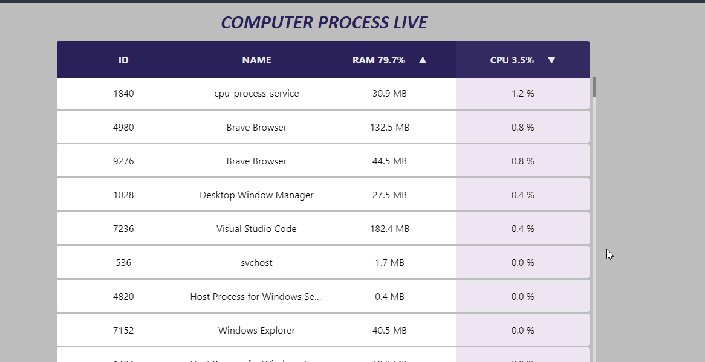
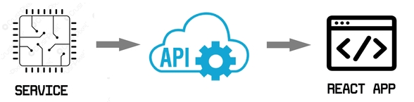

# Computer Process Live

### This project sends live process data through websockets  <b>Includes:</b>
- A react app as the front end to display the processes in the browser.
- Websocket/SignalR .Net Api for the communication between the worker/frontend.
- .Net Console/WorkerService that gathers the computer process data. 
 
 

## How to Use. 

- Start the cpu-process-service with "dotnet run" or with the .exe.
- Run the cpu_process-api with "dotnet run" or with the .exe.
- Execute the cpu-process-web with "npm start".
 
 